Domanico_Laboratory_Work_2A

# Plant_Species_Image_Classification
Laboratory Work 2-A | Image Classification Using Teachable Machine
---
# Google Drive Link: https://drive.google.com/drive/folders/1pukh1bTZ4dfP0IpW8uW9olXx32hO70Vk

## A. Project Overview
**Project Description and Project Purpose:** 

The image classification model was trained using 100 epochs, a batch size of 16, and a learning rate of 0.001. These parameters were selected because the dataset consists of 20 plant species with 250 images per class, resulting in a balanced dataset of approximately 5,000 images.

An epoch value of 100 was chosen to provide the model with enough training iterations to learn the distinguishing characteristics of each plant species while minimizing the risk of underfitting. Since the dataset is sufficiently large and balanced, 100 epochs offer a good compromise between training performance and training time.

A batch size of 16 was selected because it allows the model to process a moderate number of images before updating its weights. This batch size provides stable learning while keeping memory usage manageable, making it suitable for image classification tasks.

A learning rate of 0.001 was used because it is a widely accepted default value for transfer learning models. This learning rate enables the model to update its weights gradually, helping achieve stable convergence while avoiding large weight changes that could negatively affect model accuracy.

Overall, these training parameters were selected to achieve a balance between training efficiency, model accuracy, and generalization performance for the plant species image classification task.

## B. Plant Species Section

### 1. Echeveria

* **Common Name:** Echeveria
* **Scientific Name:** *Ornamental Plants* 'Echeveria elegans'
* **Description:** Echeveria is a succulent ornamental plant recognized by its compact rosette of thick, fleshy leaves. It is popular for indoor decoration, rock gardens, and container planting because of its attractive appearance and drought tolerance..

### 2. Barrel Cactus

* **Common Name:** Barrel Cactus
* **Scientific Name:** *Ornamental Plants* 'Echinocactus grusonii'
* **Description:** A stunning, slow-growing houseplant famous for its dark green, glossy leaves with intricate, creamy-white pinstripes. It features an upright, self-heading growth habit.

### 3. Wisteria

* **Common Name:** Wisteria
* **Scientific Name:** *Ornamental Plants* 'Wisteria sinensis'
* **Description:** Wisteria is a flowering vine known for its cascading clusters of fragrant purple, blue, or white flowers. It is widely used on pergolas, fences, and garden trellises. 

### 4. English Ivy
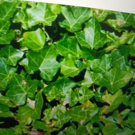
* **Common Name:** English Ivy
* **Scientific Name:**  'Hedera helix'
* **Description:** English ivy is an evergreen climbing vine valued for its dense foliage. It is commonly grown as a ground cover, hanging plant, or decorative wall climber.

### 5.Impatiens
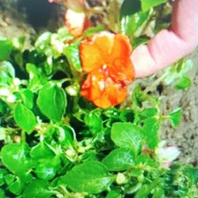
* **Common Name:** Impatiens
* **Scientific Name:** 'Impatiens walleriana'
* **Description:** Impatiens is a colorful flowering ornamental plant that grows well in shaded areas. It produces abundant blooms in various colors throughout the growing season.

### 6. Snapdragon
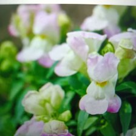
* **Common Name:** Snapdragon
* **Scientific Name:**  'Antirrhinum majus'
* **Description:** Snapdragons are ornamental flowering plants known for their tall flower spikes and colorful blossoms. Their flowers resemble the face of a dragon when gently squeezed.

### 7. Pansy

* **Common Name:** Pansy
* **Scientific Name:** 'Viola × wittrockiana'
* **Description:** Pansies are popular garden flowers recognized by their large, colorful blooms and distinctive petal patterns. They are commonly planted in flower beds and containers.

### 8. Foxglove
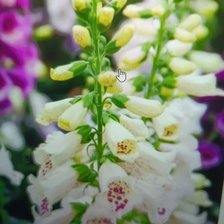
* **Common Name:** Foxglove
* **Scientific Name:** *Digitalis purpurea*
* **Description:** Foxglove produces tall spikes of bell-shaped flowers in shades of purple, pink, and white. It is widely cultivated for its ornamental beauty in cottage gardens.
  
### 9. Peony
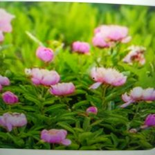
* **Common Name:** Peony
* **Scientific Name:** 'Paeonia lactiflora'
* **Description:** Peonies are perennial ornamental plants admired for their large, fragrant flowers. They are commonly used in landscaping and floral arrangements.

### 10. Anemone
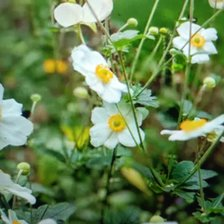
* **Common Name:** Anemone
* **Scientific Name:** 'Anemone coronaria' 
* **Description:** Anemones are flowering plants that produce bright, colorful blooms with contrasting dark centers. They are popular ornamental flowers in gardens and bouquets.

  
### 11. Ranunculus
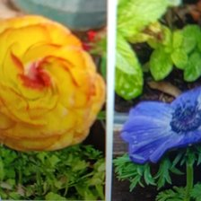
* **Common Name:** Ranunculus
* **Scientific Name:** 'Ranunculus asiaticus'
* **Description:** Ranunculus is known for its layered, rose-like flowers available in many vibrant colors. It is widely cultivated for ornamental gardens and cut flowers.

### 12. Freesia

* **Common Name:** Freesia
* **Scientific Name:** 'Freesia refracta'
* **Description:** Freesia is a fragrant flowering plant with elegant trumpet-shaped blossoms. It is commonly grown for ornamental purposes and used in floral decorations.

### 13. Maranta (Prayer Plant)
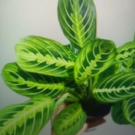
* **Common Name:** Maranta (Prayer Plant)
* **Scientific Name:** 'Maranta leuconeura'
* **Description:** The prayer plant is a tropical ornamental plant known for its decorative leaves that fold upward at night, resembling hands in prayer.

### 14. Ficus Benjamina
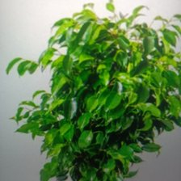
* **Common Name:** Ficus Benjamina
* **Scientific Name:**'Ficus benjamina'
* **Description:** Ficus benjamina is a popular ornamental indoor tree with glossy green leaves and gracefully arching branches. It is commonly used in homes and offices.

### 15.Chinese Evergreen
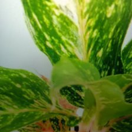
* **Common Name:** Chinese Evergreen
* **Scientific Name:** 'Aglaonema commutatum'
* **Description:** Chinese evergreen is an ornamental foliage plant appreciated for its attractive variegated leaves and ability to thrive under low-light indoor conditions.

### 16. Polka Dot Plant
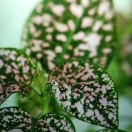
* **Common Name:** Polka Dot Plant
* **Scientific Name:** 'Hypoestes phyllostachya'
* **Description:** The polka dot plant is a colorful ornamental foliage plant recognized for its spotted pink, white, or red leaves, making it popular for indoor decoration.

### 17. Nerve Plant (Fittonia)
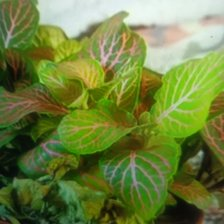
* **Common Name:** Nerve Plant (Fittonia)
* **Scientific Name:** 'Fittonia albivenis'
* **Description:** Fittonia is a tropical ornamental plant distinguished by its striking leaf veins in white, pink, or red. It is commonly grown as a houseplant.

### 18.Japanese Maple
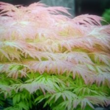
* **Common Name:** Japanese Maple
* **Scientific Name:** 'Acer palmatum'
* **Description:** Japanese maple is an ornamental tree valued for its finely divided leaves and brilliant seasonal colors, making it a centerpiece in landscape design.

  
### 19. Golden Shower
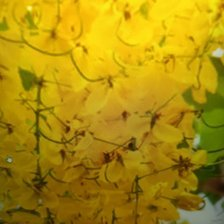
* **Common Name:** Golden Shower
* **Scientific Name:** 'Aurea'
* **Description:**The golden shower tree is a tropical ornamental tree famous for its long hanging clusters of bright yellow flowers. It is widely planted along roadsides and parks.

### 20. Passion Flower

* **Common Name:** Passion Flower
* **Scientific Name:** 'Passiflora incarnata'
* **Description:** The passion flower is a climbing ornamental vine recognized for its unique and intricate flowers. It is commonly cultivated on fences, trellises, and garden landscapes.

## C. Model Training Details
* **Epochs:** 100
* **Batch Size:** 16
* **Learning Rate:** 0.001
* **Number of Images per Class:** [250 - 260 Images]

## D. Model Evaluation

### Confusion Matrix
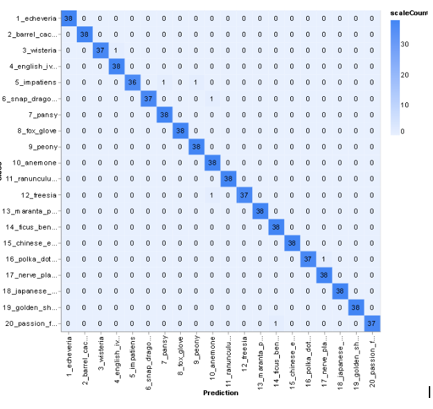

### Accuracy Per Class
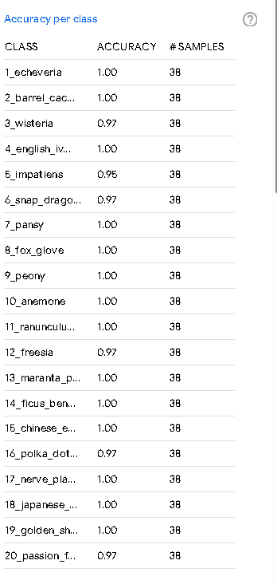

### Overall Model Accuracy
 
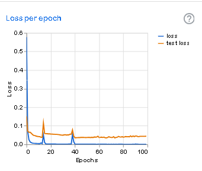 

---

## E. Model Testing

Below are 10 live testing screenshots from the Teachable Machine Preview section, demonstrating the model predicting species on unseen images.

1. 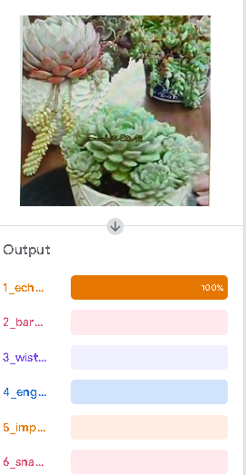
2. 
3. 
4. 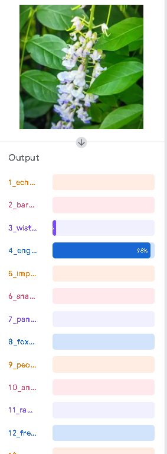
5. 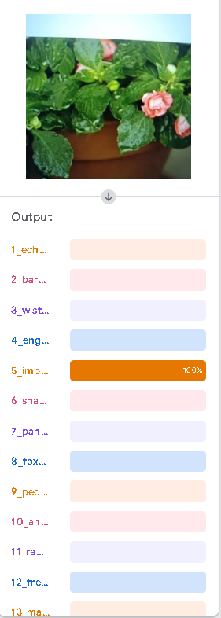
6. 
7. 
8. 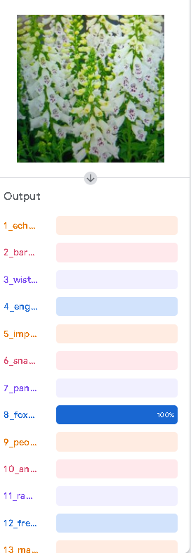
9. 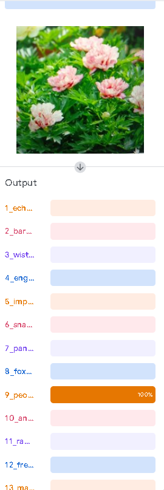
10. 

---

## F. Reflection Questions

**1. How did the number of images per class affect your model’s accuracy?**
- Having 250 images for each plant species significantly improved the model's accuracy by providing a balanced dataset for training. Since every class contained the same number of images, the model was able to learn the visual characteristics of each plant without favoring one class over another. The variety of images captured under different angles and lighting conditions also helped the model generalize better when classifying new images.

**2. Which plant species were most commonly misclassified and why?**
- Based on the confusion matrix, the model most commonly misclassified English Ivy (Hedera helix) and Maranta (Prayer Plant) (Maranta leuconeura) because both species have broad green leaves with similar textures and overlapping visual features. Likewise, Peony (Paeonia lactiflora) and Ranunculus (Ranunculus asiaticus) were occasionally confused due to their layered flower petals and similar bloom structures. These similarities made it more challenging for the model to distinguish between them.

**3. How did changing the epochs, batch size, or learning rate affect the training results?**
- The model was trained using 100 epochs, a batch size of 16, and a learning rate of 0.001. Increasing the number of epochs allowed the model to learn more detailed features from the dataset, which improved training accuracy. A batch size of 16 provided stable learning while maintaining efficient memory usage. The learning rate of 0.001 enabled gradual and consistent updates to the model's weights, resulting in smooth convergence without causing unstable training.
  
**4. What challenges did you encounter during dataset collection and labeling?**
- The biggest challenge was collecting 250 high-quality images for each of the 20 plant species. It was important to ensure that the images were clear, free of duplicates, and represented different viewing angles, lighting conditions, and backgrounds. Another challenge was organizing and labeling thousands of images correctly before uploading them to Google Teachable Machine. Preparing the dataset required considerable time and careful attention to maintain consistency across all classes.

**5. If you were to improve your model, what specific changes would you make and why?**
- If I were to improve the model, I would collect more images for each plant species with greater diversity in lighting conditions, camera angles, backgrounds, and plant growth stages. I would also include more close-up images of leaves, flowers, and stems to help the model learn finer distinguishing features. Additionally, I would experiment with different training parameters, such as increasing the number of epochs or adjusting the learning rate, to determine whether the model's accuracy and overall performance could be further improved.

