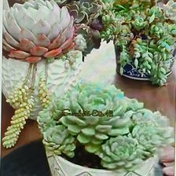
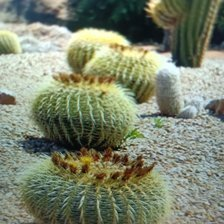
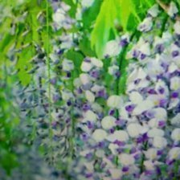

Domanico_Laboratory_Work_2A

# Plant_Species_Image_Classification
Laboratory Work 2-A | Image Classification Using Teachable Machine
---
# Google Drive Link: [https://drive.google.com/drive/folders/1jPQKnP-vnhCB6xq0iRyN5vXNMneHgDym?usp=drive_link](https://drive.google.com/drive/folders/1pukh1bTZ4dfP0IpW8uW9olXx32hO70Vk)
# Github Repo Link:  https://github.com/zhairamilan/Plant_Species_Image_Classification

## A. Project Overview
**Project Description and Project Purpose:** 

The image classification model was trained using 100 epochs, a batch size of 16, and a learning rate of 0.001. These parameters were selected because the dataset consists of 20 plant species with 250 images per class, resulting in a balanced dataset of approximately 5,000 images.

An epoch value of 100 was chosen to provide the model with enough training iterations to learn the distinguishing characteristics of each plant species while minimizing the risk of underfitting. Since the dataset is sufficiently large and balanced, 100 epochs offer a good compromise between training performance and training time.

A batch size of 16 was selected because it allows the model to process a moderate number of images before updating its weights. This batch size provides stable learning while keeping memory usage manageable, making it suitable for image classification tasks.

A learning rate of 0.001 was used because it is a widely accepted default value for transfer learning models. This learning rate enables the model to update its weights gradually, helping achieve stable convergence while avoiding large weight changes that could negatively affect model accuracy.

Overall, these training parameters were selected to achieve a balance between training efficiency, model accuracy, and generalization performance for the plant species image classification task.

## B. Plant Species Section

### 1. Echeveria

* **Common Name:** Echeveria
* **Scientific Name:** *Ornamental Plants* 'Echeveria elegans'
* **Description:** Echeveria is a succulent ornamental plant recognized by its compact rosette of thick, fleshy leaves. It is popular for indoor decoration, rock gardens, and container planting because of its attractive appearance and drought tolerance..

### 2. Barrel Cactus

* **Common Name:** Barrel Cactus
* **Scientific Name:** *Ornamental Plants* 'Echinocactus grusonii'
* **Description:** A stunning, slow-growing houseplant famous for its dark green, glossy leaves with intricate, creamy-white pinstripes. It features an upright, self-heading growth habit.

### 3. Wisteria

* **Common Name:** Wisteria
* **Scientific Name:** *Ornamental Plants* 'Wisteria sinensis'
* **Description:** Wisteria is a flowering vine known for its cascading clusters of fragrant purple, blue, or white flowers. It is widely used on pergolas, fences, and garden trellises. 

### 4. English Ivy

* **Common Name:** English Ivy
* **Scientific Name:**  'Hedera helix'
* **Description:** English ivy is an evergreen climbing vine valued for its dense foliage. It is commonly grown as a ground cover, hanging plant, or decorative wall climber.

### 5.Impatiens

* **Common Name:** Impatiens
* **Scientific Name:** 'Impatiens walleriana'
* **Description:** Impatiens is a colorful flowering ornamental plant that grows well in shaded areas. It produces abundant blooms in various colors throughout the growing season.

### 6. Snapdragon

* **Common Name:** Snapdragon
* **Scientific Name:**  'Antirrhinum majus'
* **Description:** Snapdragons are ornamental flowering plants known for their tall flower spikes and colorful blossoms. Their flowers resemble the face of a dragon when gently squeezed.

### 7. Pansy

* **Common Name:** Pansy
* **Scientific Name:** 'Viola × wittrockiana'
* **Description:** Pansies are popular garden flowers recognized by their large, colorful blooms and distinctive petal patterns. They are commonly planted in flower beds and containers.

### 8. Foxglove

* **Common Name:** Foxglove
* **Scientific Name:** *Digitalis purpurea*
* **Description:** Foxglove produces tall spikes of bell-shaped flowers in shades of purple, pink, and white. It is widely cultivated for its ornamental beauty in cottage gardens.
  
### 9. Peony

* **Common Name:** Peony
* **Scientific Name:** 'Paeonia lactiflora'
* **Description:** Peonies are perennial ornamental plants admired for their large, fragrant flowers. They are commonly used in landscaping and floral arrangements.

### 10. Anemone

* **Common Name:** Anemone
* **Scientific Name:** 'Anemone coronaria' 
* **Description:** Anemones are flowering plants that produce bright, colorful blooms with contrasting dark centers. They are popular ornamental flowers in gardens and bouquets.

  
### 11. Ranunculus

* **Common Name:** Ranunculus
* **Scientific Name:** 'Ranunculus asiaticus'
* **Description:** Ranunculus is known for its layered, rose-like flowers available in many vibrant colors. It is widely cultivated for ornamental gardens and cut flowers.

### 12. Freesia

* **Common Name:** Freesia
* **Scientific Name:** 'Freesia refracta'
* **Description:** Freesia is a fragrant flowering plant with elegant trumpet-shaped blossoms. It is commonly grown for ornamental purposes and used in floral decorations.

### 13. Maranta (Prayer Plant)

* **Common Name:** Ficus Benjamina
* **Scientific Name:**'Ficus benjamina'
* **Description:** Ficus benjamina is a popular ornamental indoor tree with glossy green leaves and gracefully arching branches. It is commonly used in homes and offices.

### 15.Chinese Evergreen

* **Common Name:** Chinese Evergreen
* **Scientific Name:** 'Aglaonema commutatum'
* **Description:** Chinese evergreen is an ornamental foliage plant appreciated for its attractive variegated leaves and ability to thrive under low-light indoor conditions.

### 16. Polka Dot Plant

* **Common Name:** Polka Dot Plant
* **Scientific Name:** 'Hypoestes phyllostachya'
* **Description:** The polka dot plant is a colorful ornamental foliage plant recognized for its spotted pink, white, or red leaves, making it popular for indoor decoration.

### 17. Nerve Plant (Fittonia)

* **Common Name:** Nerve Plant (Fittonia)
* **Scientific Name:** 'Fittonia albivenis'
* **Description:** Fittonia is a tropical ornamental plant distinguished by its striking leaf veins in white, pink, or red. It is commonly grown as a houseplant.

### 18.Japanese Maple

* **Common Name:** Japanese Maple
* **Scientific Name:** 'Acer palmatum'
* **Description:** Japanese maple is an ornamental tree valued for its finely divided leaves and brilliant seasonal colors, making it a centerpiece in landscape design.

  
### 19. Golden Shower

* **Common Name:** Golden Shower
* **Scientific Name:** 'Aurea'
* **Description:**The golden shower tree is a tropical ornamental tree famous for its long hanging clusters of bright yellow flowers. It is widely planted along roadsides and parks.

### 20. Passion Flower

* **Common Name:** Passion Flower
* **Scientific Name:** 'Passiflora incarnata'
* **Description:** The passion flower is a climbing ornamental vine recognized for its unique and intricate flowers. It is commonly cultivated on fences, trellises, and garden landscapes.

## C. Model Training Details
* **Epochs:** 100
* **Batch Size:** 16
* **Learning Rate:** 0.001
* **Number of Images per Class:** [250 - 260 Images]

## D. Model Evaluation

### Confusion Matrix

### Accuracy Per Class

### Overall Model Accuracy

---

## E. Model Testing

Below are 10 live testing screenshots from the Teachable Machine Preview section, demonstrating the model predicting species on unseen images.

1. 
2. 
3. 
4. 
5. 
6. 
7. 
8. 
9. 
10. 

---

## F. Reflection Questions

**1. How did the number of images per class affect your model’s accuracy?**
- In my experience, hitting the 250-image mark per species was essential for the model to actually learn the differences in leaf texture and variegation. Since many Philodendrons look similar, having a larger dataset allowed the model to see the plants under different lighting conditions. I noticed that for the classes where the scraper picked up more varied images, the confidence score in the preview section was much higher. If I had used fewer images, I don't think the model would have been able to distinguish between the subtle green-on-green patterns of some of the climbing varieties.

**2. Which plant species were most commonly misclassified and why?**
- The model struggled the most with the Philodendron Birkin and the Epipremnum/Pothos varieties. For the Birkin, it occasionally got confused if the training data included the "Rojo Congo" version (which is the parent plant) or if the pinstripes weren't clear. There was also a lot of confusion between the Neon Pothos and the Malay Gold because they both share that bright, fluorescent chartreuse color. The model seems to prioritize color over leaf shape in some cases, which led to these mix-ups between the trailing and upright species.

**3. How did changing the epochs, batch size, or learning rate affect the training results?**
- I kept the parameters at the suggested levels (50 epochs, 16 batch size, 0.001 learning rate), but I noticed that the batch size was particularly important for my computer's performance. When the browser was processing the images, I could tell the system was under a lot of stress. Sticking to a batch size of 16 seemed to be the "sweet spot" that allowed the model to update its weights frequently enough to reach high accuracy without crashing the Chrome tab. If I had lowered the learning rate further, it felt like the 50 epochs wouldn't have been enough to reach the high accuracy I eventually saw.
  
**4. What challenges did you encounter during dataset collection and labeling?**
- This was the most difficult part of the lab. My biggest challenge was "data noise" caused by search engines. For example, when searching for "Birkin," the scraper initially pulled hundreds of photos of luxury handbags instead of the Philodendron Birkin plant. I had to spend a lot of time refining my Python script's search queries to filter these out. I also ran into several Windows permission errors (WinError 32) while trying to rename and organize the files, because the system wouldn't let Python touch the images while they were being previewed in my folder.

**5. If you were to improve your model, what specific changes would you make and why?**
- If I were to do this again, I would spend more time on manual "data pruning." Even with a good scraper, some images contained watermarks, human hands holding the pots, or multiple different plants in the background, which can confuse the AI. I would also use the image-shrinking script I developed right from the start. By resizing everything to 224x224 before uploading, the training process would be much faster and the browser wouldn't freeze, allowing me to potentially test even more than 20 species or more images per class.

